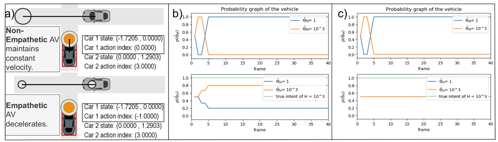

# When Shall I Estimate Your Intent?
## Costs and Benefits of Intent Inference in Multi-Agent Interactions

This repository contains the code for our paper [When Shall I Estimate Your Intent?
Costs and Benefits of Intent Inference in Multi-Agent Interactions](https://ieeexplore.ieee.org/abstract/document/9867155) (ACC-22).

## Table of Contents
1. [Introduction](#introruction)
2. [Motivation](#result_1)
3. [Performance Comparison of Intermittent Empathetic Intent Inference with Baseline Algorithms](#results_2)
4. [Intermittent Intent Inference with Measurement Noise](#results_3)
5. [Instruction to reproduce the results](#instruction)
6. [Acknowledgement](#ackowledgements)
7. [Contact](#contact)
   
## Introduction 

This paper addresses incomplete-information dynamic games, where reward parameters of agents are private. Previous studies have shown that online belief update is necessary for deriving equilibrial policies of such games, especially for high-risk games such as vehicle interactions. However, updating beliefs in real time is computationally expensive as it requires continuous computation of Nash equilibria of the sub-games starting from the current states. In this paper, we consider the triggering mechanism of belief update as a policy defined on the agents’ physical and belief states, and propose learning this policy through reinforcement learning (RL). Using a two-vehicle uncontrolled intersection case, we show that intermittent belief update via RL is sufficient for safe interactions, reducing the computation cost of updates by 59% when agents have full observations of physical states. Simulation results also show that the belief update frequency will increase as noise becomes more significant in measurements of the vehicle positions.

 

## Motivation 
We first study the impact of different intent inference frequencies by letting the AV perform intent inference once in every three time steps. Here, the AV was non-aggressive and the H was aggressive. We perform two simulations with both the AV and H as (1) empathetic, and (2) non-empathetic. In this test, we set the initial positions of both vehicles 2 meters away from the intersection. 

 

Observation: The empathetic agent chooses to decelerate while the non-empathetic agent chooses to maintain its velocity. Empathetic intent inference with a reduced update frequency shows AV taking significant time to predict the true intent of H. Non-empathetic intent inference with a reduced update frequency shows AV being unable to predict the true intent of the H. This provides preliminary evidence to use empathetic intent inference intermittently. We can see that by just choosing to increase the interval between the belief updates, one can get the correct inference of H’s intent but it takes more instances of belief updates. This motivated us to model the intent inference algorithm as an RL problem, where, instead of reducing the interval between belief update, we let the RL agent decide whether or not to perform belief update at a given time step.

 

Block diagram of the RL-based intermittent empathetic intent inference. The RL agent takes the states from the environment and provides ACTION [0,1]. The vehicle in the green box represents H, which gives a constant signal $1$ to do belief update at every timestep. Current physical states, $S_p$, input states, $U_p$, and the current joint probability matrix, $B_{\theta}$, are input for the intent inference block, which returns the distribution of the probability of the other agent and the marginal probability of the trajectory. The reactive motion provides action for the AV, which incorporates the inferred motion and intent of the agents.

## Performance Comparison of Intermittent Empathetic Intent Inference with Baseline Algorithms 
The baseline empathetic and non-empathetic intent inference algorithms are presented in the Methods in the paper, and they ran at each time step in our study. Whereas, in the intermittent intent inference case, the AV decides whether it needs to conduct empathetic intent inference using the policy learned from the RL algorithm. The baseline algorithms are compared with the intermittent empathetic (I) intent inference algorithm. The initial position $x_H$ is sampled randomly from $x_H \in [2.5, 1.5]$ and $x_{AV}$ is sampled randomly from $x_{AV} \in [-1.5, -2.5]$.

 

Observation: We find that switching to intermittent intent inference has several benefits, primarily in terms of memory consumption and computation time. 
The results of the comparison are shown in Table. As expected, we see a decrease in the average memory used for computation when AV performed belief updates intermittently as opposed to the cases when it was updated at every time step. As a result, the average time to process one sample of measurement in the simulation also decreases, suggesting that the algorithm has the potential to function in real time. The results are promising as they substantiate our claim that updating beliefs intermittently, as necessary, is able to maintain safe vehicle interaction as characterized by the distance between the vehicles and the cumulative reward collected by them. The value, in fact, is higher when the AV updated beliefs intermittently.

## [Intermittent Intent Inference with Measurement Noise] 
We carry out intent inference in the presence of noise in the observation of physical states. In particular, we model the AV with measurements of the H's physical states. The initial positions of AV and H were set as $x_{AV} \in [-1.25, -1.0]$ and $x_{H} \in [1.35, 1.6]$, meaning both agents were closer to the intersection compared to the previous case study. For all the test cases, we choose both agents to be empathetic, based on the results of the previous studies. A Gaussian white noise  $n \sim \mathcal{N}(0,\,\sigma^{2})\,$ is introduced into the AV's observation of the H's position, with standard deviation of $\sigma = [0.0, 0.00625, 0.0125, 0.025, 0.05]$.

 
 

Observation: a) Intermittent AV is able to stop before collision in the presence of noise. b) Different estimated intent by  the AV in the presence of noise. c) Trajectories in different belief updates. 
In safety-critical cases, intermittent intent inference shows inverse relationship between inference ratio and rate of collision.

## Instructions to reproduce the results 
As a classic reinforcement learning algorithm, we need to look into the environment and the agent.
To run the experiment, we use results\Intermittent_Emp_Int_Inf.py. Here the environment, actors and configuration for the reinforcement learning problem is defined as well as the configuration to store the graphs and data. The hyperparameters for the learning agnet is also defined in this file. For the second experiments on the noise level "config.environment.noise_level" is used. The noise level is thus used in the Environment. The Environment is defined is defined in gym. The training environment of the RL problem is in environments\Intent_Inference_Env_Training. This converts the original [SocialGracefulness](https://ieeexplore.ieee.org/stamp/stamp.jsp?arnumber=8911426) into a gym environment for the RL problem. 

## Acknowledgement  
This repo contains code that's based on the following code: [Deep Reinforcement Learning Algorithms with PyTorch](https://github.com/p-christ/Deep-Reinforcement-Learning-Algorithms-with-PyTorch).
This repo requires working in conjunction with the following code base: [SocialGracefullnessTIV](https://github.com/sunamatya/SocialGracefullnessTIV)

## BibTeX

If you find this repository or the ideas presented in our paper useful for your research, please consider citing our paper.

@inproceedings{amatya2022shall,
  title={When Shall I Estimate Your Intent? Costs and Benefits of Intent Inference in Multi-Agent Interactions},
  author={Amatya, Sunny and Ghimire, Mukesh and Ren, Yi and Xu, Zhe and Zhang, Wenlong},
  booktitle={2022 American Control Conference (ACC)},
  pages={586--592},
  year={2022},
  organization={IEEE}
}

## Contact 

Feel free to contact <a href="mailto:Wenlong.Zhang@asu.edu">Wenlong Zhang</a> or <a href="mailto:sunnyamatya@gmail.com">Sunny Amatya</a> for any questions regarding the code or the paper. Please visit our website for more information: [RISE website](https://home.riselab.info/).
